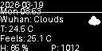
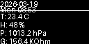

# ESP32S3-AirQuality-Station

基于 ESP32-S3 的高性能环境监测站，集成了空气质量检测、实时气象预报、MQTT 遥测及 OLED 分页显示功能。

## 📸 预览 (模拟截图)
| 天气预报页 (Page 0) | 实时传感器页 (Page 1) |
| :---: | :---: |
|  |  |

## 🌟 核心特性
- **双空气质量传感器**：
  - **Bosch BME680**：通过官方 BSEC2 算法提供 IAQ（室内空气质量）、等效 CO2、气压、温湿度监测。
  - **AGS10**：高精度 TVOC（总挥发性有机化合物）实时监测。
- **动态天气预报**：集成 OpenWeatherMap API，实时显示当地天气描述及对应状态图标（右上角展示）。
- **智能交互 UI**：
  - 128x64 SSD1306 OLED 屏幕，支持多页自动轮播及手动按键唤醒。
  - 支持夜间模式：在预设时间段（如 22:00-07:00）自动关闭 RGB 指示灯，避免光污染。
- **物联网支持**：
  - 支持 MQTT 协议，定时向 Broker 发送 JSON 格式的传感器完整遥测数据。
  - NTP 时间同步。
- **RGB 状态提示**：根据 TVOC 浓度，RGB LED 以不同颜色（蓝/黄/红）及频率呼吸提示空气质量等级。

## 🛠️ 硬件需求
- ESP32-S3 开发板
- BME680 传感器 (I2C)
- AGS10 传感器 (I2C)
- SSD1306 OLED 屏幕 (128x64, I2C)
- RGB LED (Neopixel, GPIO 48)

## 📦 库依赖
请确保在 Arduino IDE 中安装以下库：
- `BSEC2 Software Library`
- `Adafruit GFX Library`
- `Adafruit SSD1306`
- `PubSubClient`
- `ArduinoJson`
- `WiFi` & `HTTPClient`

## 🚀 快速上手
1. 克隆本项目。
2. 在项目根目录下创建 `secrets.h` 文件（该文件已在 `.gitignore` 中排除，确保信息安全）。
3. 在 `secrets.h` 中填入您的配置：
```cpp
#ifndef SECRETS_H
#define SECRETS_H

const char* WIFI_SSID = "您的WiFi名称";
const char* WIFI_PASS = "您的WiFi密码";
const char* MQTT_HOST = "您的MQTT服务器IP";
const uint16_t MQTT_PORT = 1883;
const char* MQTT_USER = "您的MQTT用户名";
const char* MQTT_PASS = "您的MQTT密码";
const char* WEATHER_URL = "http://api.openweathermap.org/data/2.5/weather?q=城市,国家&units=metric&APPID=您的API密钥";

#endif
```
4. 编译并上传至您的 ESP32-S3。

## 📄 许可证
MIT License
